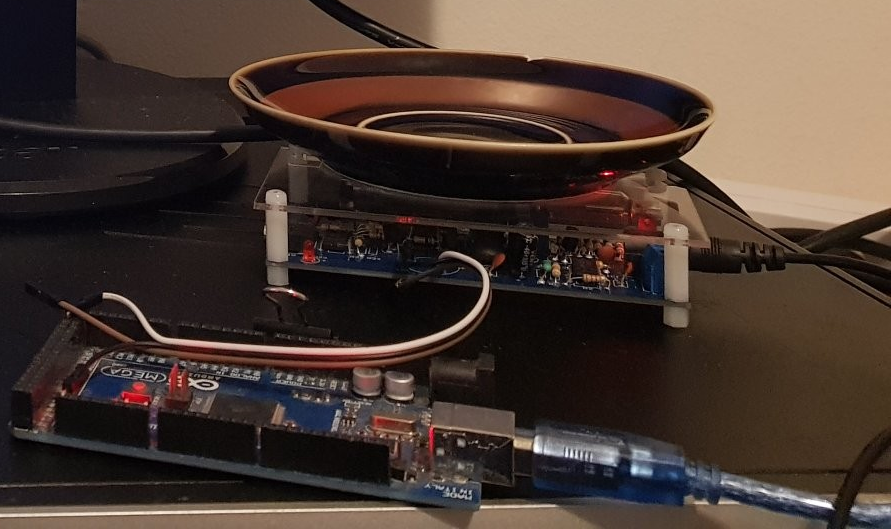

# STRNG4DS

## Project Summary:
Use a small radioactive sample to generate true random to seed /dev/random on linux dedicated servers.

# Arduino

### Compiling Arduino:
Use Arduino IDE with modifications for your board, this prototype used the mega however many other boards should work perfectly fine.
If you are using a different board you may need to change the `interruptPin` used by `attachInterrupt`.

# Linux

### Compiling linux source to binary:
`gcc strng4ds.c -o strng4ds.out -lm`

### Running binary
You will need to use the sudo command or run as root to use the binary to modify /dev/random
You can run using:
`sudo ./strng4ds.out`
